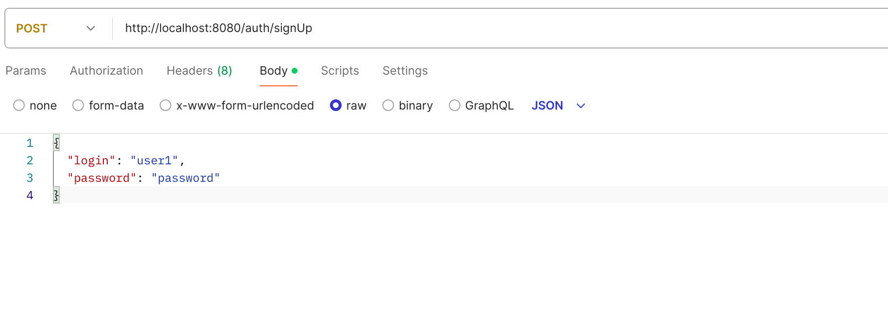
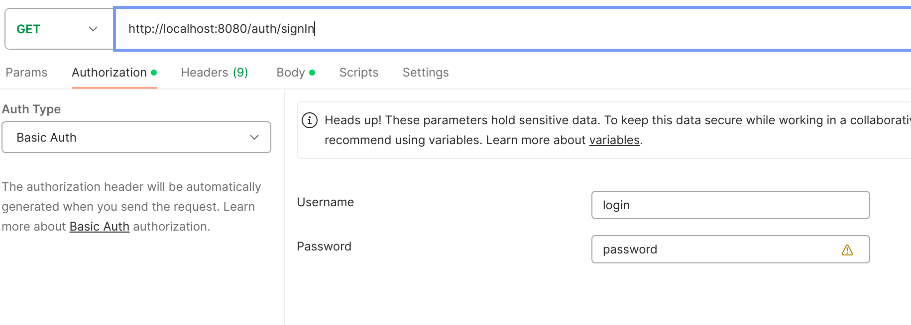
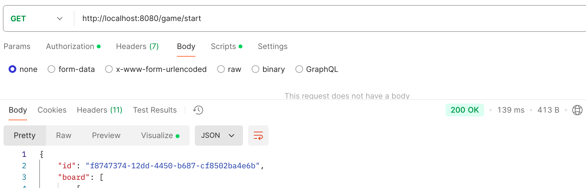
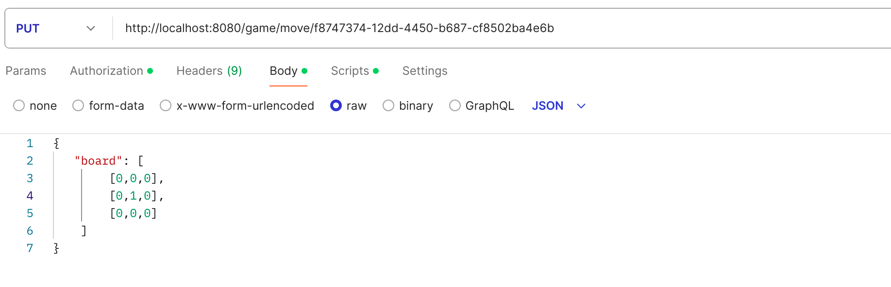

# Крестики-Нолики - Проект на Java с использованием Spring

## Описание
Проект реализует игру "Крестики-Нолики" с использованием фреймворка Spring.
В проекте реализованы слои `web`, `domain`, `datasource`, `service` и `di` для организации многослойной архитектуры, а также для работы с базой данных PostgreSQL и авторизацией пользователей.

## Структура проекта
1. **web** - взаимодействие с клиентом (контроллеры, мапперы).
2. **domain** - бизнес-логика игры (сервисы, модели).
3. **datasource** - работа с данными (репозитории, мапперы).
4. **di** - внедрение зависимостей и конфигурация Spring.
5. **service** - классы сервисы.

## Установка и настройка

### 1. Создание и настройка базы данных

```properties
spring.datasource.url=jdbc:postgresql://localhost:5432/tictactoe
spring.datasource.username=your_db_user
spring.datasource.password=your_db_password
spring.jpa.hibernate.ddl-auto=update
spring.jpa.show-sql=true
```
### 2. Зависимости

- JDK 18 и выше.
- PostgreSQL.
- Spring Boot.
- Gradle (Kotlin DSL).

### 3. Запуск приложения

#### 1. Скачайте все зависимости с помощью Gradle:

```bash
./gradlew build
```

#### 2. Запустите приложение:

```bash
./gradlew bootRun
```

### 4. Тестирование

Для тестирования используйте Postman или любой другой инструмент для отправки HTTP-запросов.

- Регистрация пользователя: `POST /auth/signUp`



- Авторизация пользователя: `GET /auth/signIn`



- Создание новой игры: `GET /game/start`



- Игра: `POST /game/{gameUUID}`
  - где 1 - ход игрока, -1 - ход компьютера   

